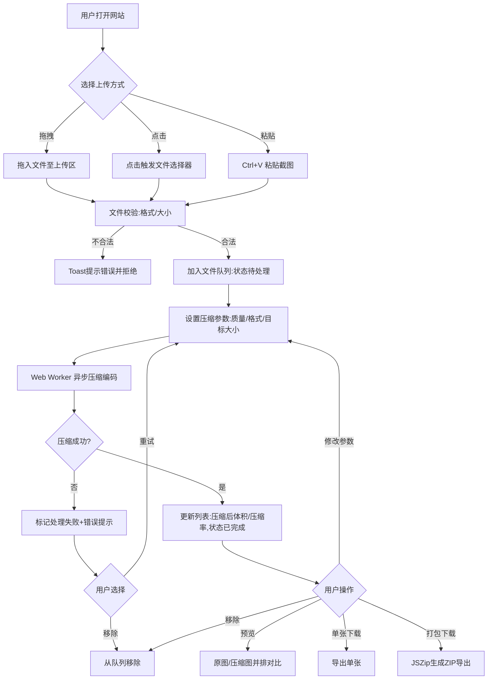
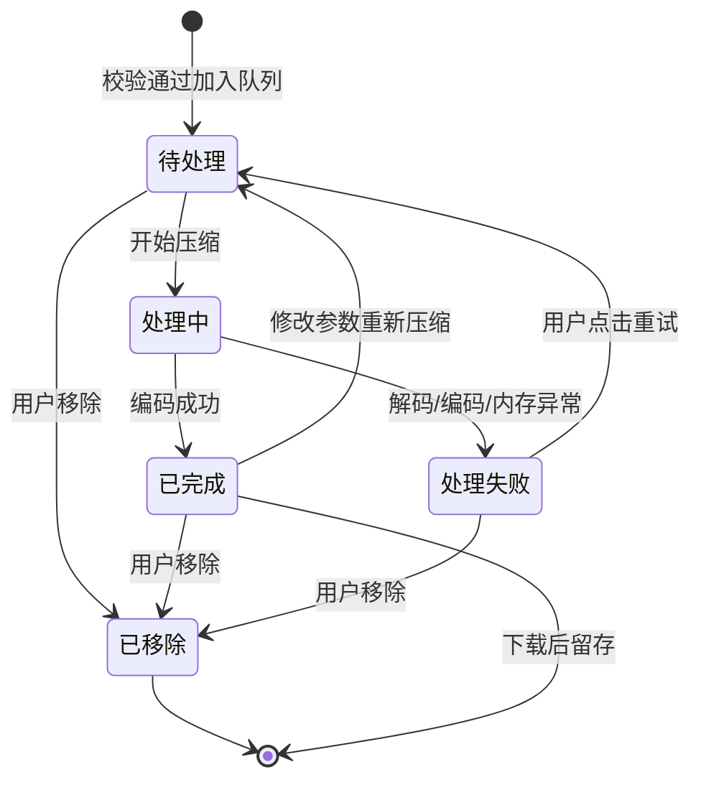
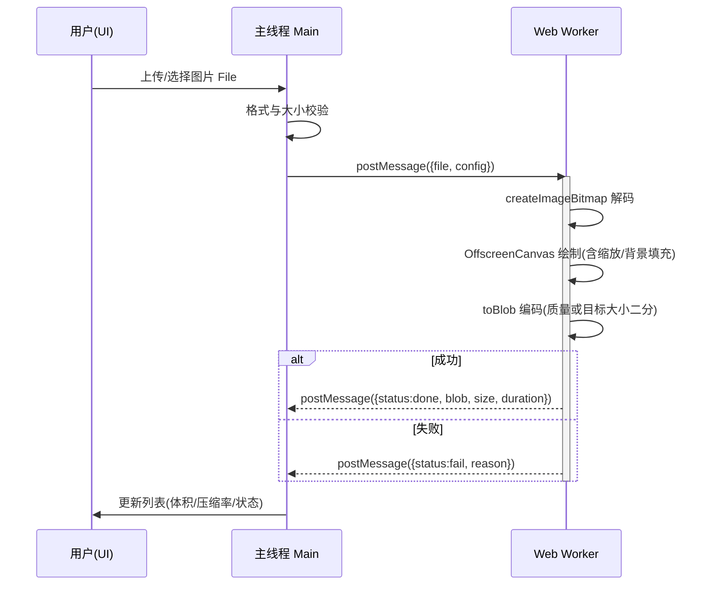
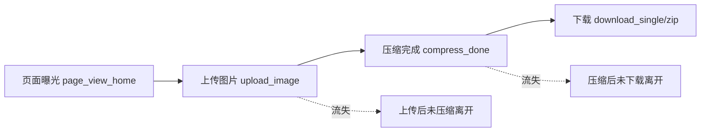

# PRD · 纯前端图片压缩网站

> 文档版本：v1.1 ｜ 撰写日期：2026-07-15 ｜ 产品经理：AI PM ｜ 状态：评审中
> 技术路线：纯前端、隐私优先（浏览器端压缩，图片不上传服务器）

## 修订记录
| 版本 | 日期 | 修订人 | 修订内容 |
| :--- | :--- | :--- | :--- |
| v1.0 | 2026-07-15 | AI PM | 初版：现状机会/目标/范围/流程/需求详情/埋点 |
| v1.1 | 2026-07-15 | AI PM | 细化：补全各模块字段级定义表；新增验收标准；新增异常与边界处理总表；新增主线程↔Worker 时序图；埋点补漏斗图与指标定义表、缺失事件；新增名词解释与不在范围内说明 |

---

## 1. 现状与机会

### 1.1 现状（As-Is）
当前市面上的在线图片压缩工具普遍存在以下痛点：

1. **隐私风险高**：多数工具要求将图片上传至服务器压缩，用户的身份证、合同、商业素材等敏感图片存在泄露与留存风险。
2. **体验受限**：免费版普遍加水印、限制单次张数、限制文件大小，或强制注册登录才能下载。
3. **批量能力弱**：大量工具仅支持单张处理，批量压缩需逐个操作，效率低下。
4. **成本转嫁**：服务器压缩带来带宽与算力成本，导致站点广告多、高峰期排队慢、易超时。
5. **新格式支持滞后**：AVIF 等高压缩比新格式覆盖少，用户难以一站式完成格式优化。

### 1.2 机会（Opportunity）
- 以「**纯前端 + 隐私优先**」为差异化卖点：图片全程在浏览器本地处理，断网可用，从机制上消除隐私顾虑，建立信任。
- **零服务器算力成本**：纯静态托管，边际成本趋近于零，可长期免费、无水印、不限次。
- 借助 WebAssembly / Canvas 原生能力，**处理速度媲美服务端**，且支持 WebP/AVIF 等现代格式，覆盖开发者与内容创作者的高阶需求。

---

## 2. 目标（Goals）

> 北极星指标：**上传→下载转化率**（下载用户数 / 上传用户数）。

1. **功能目标**：MVP 上线即支持 JPG/PNG/WebP 的质量压缩、原图/压缩图并排对比、单张与 ZIP 打包下载，单页闭环可用。
2. **体验目标**：单张 5MB 图片压缩响应 < 1s；批量处理期间 UI 保持 60fps 不卡顿；首屏资源 < 1MB（WASM 按需懒加载）。
3. **隐私目标**：实现 100% 客户端处理，全流程无任何图片上传请求，支持断网验证。
4. **数据目标**：上线 30 天内，上传→下载转化率 ≥ 60%；单次会话平均处理图片数 ≥ 3 张；7 日留存 ≥ 25%；压缩成功率 ≥ 98%。
5. **覆盖目标**：兼容 Chrome / Edge / Firefox / Safari 现代版本，移动端可用。

---

## 3. 范围（Scope）

本期为**纯前端单页应用**，无后端服务，按模块拆分如下：

1. **面向终端用户的前端站点（Web，本期唯一端）**
   - 上传模块：拖拽 / 点击 / 粘贴多渠道上传，批量入队。
   - 压缩设置模块：质量滑块、输出格式选择、目标大小压缩、尺寸调整。
   - 文件列表模块：缩略图、原大小、压缩后大小、压缩率、状态、操作。
   - 预览对比模块：原图与压缩图并排 / 滑块对比。
   - 下载模块：单张下载、ZIP 打包下载、复制到剪贴板。
   - 全局体验：暗色模式、移动端适配、压缩参数记忆、隐私声明。
2. **管理后台**：本期**不涉及**（纯静态产品，无运营后台需求）。
3. **后端服务**：本期**不涉及**（纯前端，仅静态资源托管）。

**不在范围内（Out of Scope）**
- GIF 动图逐帧压缩 / 转 MP4（后续版本评估）。
- 图片裁剪编辑器（仅做等比缩放，不做自由裁剪画布）。
- 用户账号体系 / 历史记录云端同步（无后端，仅本地 localStorage）。
- 开放 API 服务（需另建后端，不在本期）。
- 服务端压缩兜底（坚持纯前端，不引入上传链路）。

---

## 4. 流程（Process）

### 4.1 业务流程图
> 说明：用户通过拖拽/点击/粘贴三种方式上传图片，经格式与大小校验后入队，设置压缩参数后由 Web Worker 异步压缩，成功后可预览对比或下载，失败则提示并可重试。

### 4.2 状态流转图
> 说明：单个文件在队列中经历 待处理→处理中→已完成/处理失败 的生命周期；任意状态均可被用户移除回到结束态。

### 4.3 压缩处理时序图（技术补充）
> 说明：压缩在 Web Worker 内完成，主线程仅负责 UI 与消息调度，确保拖动滑块、滚动等交互不卡顿。失败时 Worker 回传失败原因，主线程标记状态并提示。

---

## 5. 需求详情（Requirement Details）

### 5.1 上传模块
| 页面模块 | 需求详情 (Details) | 交互原型/备注 (Interaction/Notes) |
| :--- | :--- | :--- |
| 上传区（空态） | 1. 支持拖拽上传：文件拖入页面时整页高亮虚线拖放区。 2. 支持点击上传：点击上传区触发 `<input type="file" multiple accept>`。 3. 支持粘贴上传：监听 `paste` 事件读取剪贴板图片。 4. 支持多选批量，可多次追加。 5. 格式校验：仅允许 JPG/JPEG/PNG/WebP/AVIF（输入），不合法提示「不支持的格式」。 6. 大小校验：单文件 ≤ 50MB，超出提示「单文件不可超过 50MB」。 7. 异常：拖入非文件（如文件夹/文本）提示拒绝。 | 空态展示拖拽图标+文案「拖拽图片到此处 / 或点击选择 / 也可 Ctrl+V 粘贴」；支持格式说明文字置底。 |

**字段级定义**
| 字段 | 必填 | 类型 | 长度/范围 | 默认值 | 校验规则 |
| :--- | :--- | :--- | :--- | :--- | :--- |
| file | 是 | File | ≤ 50MB | - | MIME ∈ {image/jpeg, image/png, image/webp, image/avif}；拒绝文件夹 |
| file_name | 是 | string | ≤ 100 字符 | 原文件名 | 超长截断并加「…」 |
| source_method | 是 | enum | - | - | drag / click / paste |

### 5.2 压缩设置模块
| 页面模块 | 需求详情 (Details) | 交互原型/备注 (Interaction/Notes) |
| :--- | :--- | :--- |
| 质量控制 | 1. 质量滑块范围 1–100，默认 75。 2. 拖动滑块实时（防抖 200ms）触发重新压缩。 3. PNG 无损格式时质量滑块禁用并提示「PNG 为无损格式」。 | 滑块右侧显示当前数值%；改参数后队列中已完成项自动标为待重新压缩。 |
| 输出格式 | 1. 下拉选择：保持原格式 / JPG / PNG / WebP / AVIF。 2. 默认「保持原格式」。 3. 选择 AVIF 时按需加载 WASM 编码器，加载中显示进度。 4. 浏览器不支持 AVIF 编码时选项置灰并 tooltip 说明。 | 透明 PNG 转 JPG 时弹出背景色选择（默认白 #FFFFFF）。 |
| 目标大小压缩 | 1. 勾选「目标大小」后输入目标体积（KB）。 2. 取值范围 10–10240 KB，必填，默认空。 3. 启用后覆盖质量滑块，使用二分查找逼近目标且不超标。 4. 若最低质量仍超出目标，提示「已至最低质量仍为 X KB」。 | 二分区间 [0.1, 1.0]，迭代至区间 < 0.05 或达标停止。 |
| 尺寸调整 | 1. 可选按比例缩放（10%–100%）或指定最长边像素。 2. 默认不启用，保持原尺寸。 3. 等比缩放，宽高锁定比例。 | 输入框校验为正整数；过长边超出原图时提示「不可放大」。 |

**字段级定义**
| 字段 | 必填 | 类型 | 长度/范围 | 默认值 | 校验规则 |
| :--- | :--- | :--- | :--- | :--- | :--- |
| quality | 条件必填 | number | 1–100 | 75 | output_format=png 时禁用；目标大小启用时被覆盖 |
| output_format | 是 | enum | - | keep | keep / jpg / png / webp / avif |
| target_size_enabled | 是 | boolean | - | false | - |
| target_size_kb | 条件必填 | number | 10–10240 | 空 | 启用时必填，正整数 |
| resize_enabled | 是 | boolean | - | false | - |
| resize_mode | 条件必填 | enum | - | percent | percent / longest_edge |
| resize_value | 条件必填 | number | percent: 10–100；edge: 1～原图边长 | - | 不可放大（超出原图边长报错） |
| bg_color | 条件必填 | string(hex) | #RRGGBB | #FFFFFF | 透明 PNG 转 JPG 时使用 |

### 5.3 文件列表模块
| 页面模块 | 需求详情 (Details) | 交互原型/备注 (Interaction/Notes) |
| :--- | :--- | :--- |
| 列表展示 | 1. 列：勾选框 / 缩略图 / 文件名 / 原始大小 / 压缩后大小 / 压缩率 / 状态 / 操作。 2. 状态：待处理、处理中（进度）、已完成、处理失败、已移除。 3. 压缩率以绿色↓显示，如「↓76%」。 4. 处理失败行高亮红色并展示错误原因。 | 空数据态：「还没有图片，快上传试试」。 |
| 汇总栏 | 1. 显示：原始总大小 / 压缩后总大小 / 总节省百分比。 2. 仅统计已完成项。 3. 队列为空时隐藏。 | 顶部固定汇总条。 |
| 操作 | 1. 单行操作：预览、重新压缩、移除。 2. 批量操作：全选、下载选中、移除选中、清空全部。 3. 清空全部需二次确认。 | 「清空全部」点击弹确认框。 |

**字段级定义**
| 字段 | 必填 | 类型 | 长度/范围 | 默认值 | 校验规则 |
| :--- | :--- | :--- | :--- | :--- | :--- |
| id | 是 | string | uuid | 自动生成 | 唯一标识 |
| thumb | 是 | string(dataURL) | - | - | 缩略图 URL |
| name | 是 | string | ≤ 100 | 原文件名 | - |
| original_size | 是 | number(Bytes) | > 0 | - | - |
| compressed_size | 否 | number(Bytes) | - | - | 状态=已完成时填入 |
| ratio | 否 | number(%) | 0–100 | - | = (1 − compressed/original) × 100 |
| status | 是 | enum | - | pending | pending / processing / done / fail / removed |
| error_msg | 否 | string | ≤ 200 | - | 状态=fail 时填入 |

### 5.4 预览对比模块
| 页面模块 | 需求详情 (Details) | 交互原型/备注 (Interaction/Notes) |
| :--- | :--- | :--- |
| 并排对比 | 1. 点击「预览」打开模态层，左侧原图、右侧压缩图。 2. 显示各自像素尺寸与体积。 3. 支持滚轮缩放、拖拽平移查看细节。 4. 异常：压缩失败时预览按钮置灰。 | 模态层可 ESC 关闭。 |
| 滑块对比（加分） | 1. 提供滑块模式：拖动中间分割线，左原图右压缩图无缝对比。 2. 可在「并排」与「滑块」两种模式切换。 | 滑块模式下分割线可触摸拖动。 |

### 5.5 下载模块
| 页面模块 | 需求详情 (Details) | 交互原型/备注 (Interaction/Notes) |
| :--- | :--- | :--- |
| 单张下载 | 1. 点击下载按钮触发 `<a download>`，文件名规则：`原名_压缩.扩展名`。 2. 支持浏览器 File System Access API 时可直接保存到指定目录（降级为普通下载）。 | 仅已完成项可下载。 |
| 打包下载 | 1. 勾选多个已完成项，点击「打包下载 ZIP」。 2. 使用 JSZip 在客户端生成，进度条显示打包进度。 3. 重名文件自动加序号后缀（如 a_1.jpg）。 4. 异常：内存不足时提示「文件过多，请分批下载」。 | ZIP 文件名：`compressed_时间戳.zip`。 |
| 复制到剪贴板 | 1. 支持将压缩后图片复制到系统剪贴板（`Clipboard API`）。 2. 不支持时按钮隐藏并提示「当前浏览器不支持」。 | 复制成功 Toast「已复制」。 |

**字段级定义**
| 字段 | 必填 | 类型 | 长度/范围 | 默认值 | 校验规则 |
| :--- | :--- | :--- | :--- | :--- | :--- |
| export_name | 是 | string | ≤ 120 | 原名_压缩.ext | 重名自动加序号 `_n` |
| zip_name | 是 | string | - | compressed_时间戳.zip | 仅打包下载使用 |
| selected_ids | 是 | array(string) | ≥ 1 | - | 仅含状态=已完成的项 |

### 5.6 全局体验
| 页面模块 | 需求详情 (Details) | 交互原型/备注 (Interaction/Notes) |
| :--- | :--- | :--- |
| 暗色模式 | 1. 跟随系统主题，支持手动切换。 2. 偏好存 localStorage。 | 顶栏右上角切换按钮。 |
| 移动端适配 | 1. 响应式布局，列表转卡片式。 2. 触屏支持拖拽上传、滑块对比触摸拖动。 | 断点：≤768px 移动布局。 |
| 参数记忆 | 1. 记住上次质量/格式/目标大小设置。 2. 清浏览器缓存后恢复默认。 | localStorage 存储。 |
| 隐私声明 | 1. 首次访问弹层声明「图片仅在本地处理，不会上传」。 2. 页面常驻隐私标识。 | 可「不再提示」。 |

### 5.7 异常与边界处理总表
| 场景 | 触发条件 | 处理策略 | 用户提示 |
| :--- | :--- | :--- | :--- |
| 断网 | 无网络连接 | 正常可用（纯前端）；埋点本地缓存，联网后补报 | 无（静默） |
| 格式不支持 | 输入非白名单格式 | 校验拦截，拒绝入队 | 「不支持的格式，仅支持 JPG/PNG/WebP/AVIF」 |
| 超大文件 | 单文件 > 50MB | 校验拦截 | 「单文件不可超过 50MB」 |
| 超大像素 | 解码后像素过大（如 > 100MP） | 警告并尝试处理，失败则标记 | 「图片尺寸过大，可能处理失败」 |
| 内存不足(OOM) | Worker 编码抛出内存异常 | 捕获异常，标记失败，建议分批 | 「内存不足，请减少批量数量或分批处理」 |
| 解码失败 | createImageBitmap 抛错 | 标记失败 | 「图片解码失败，文件可能已损坏」 |
| 编码失败 | toBlob/WASM 编码抛错 | 标记失败，可重试 | 「压缩失败，请重试」 |
| AVIF 不可用 | WASM 加载失败/浏览器不支持 | 自动降级为 WebP | 「AVIF 不可用，已自动切换为 WebP」 |
| 重名文件 | 打包下载存在同名 | 自动加序号后缀 | 无（静默） |
| 空数据 | 队列为空 | 隐藏汇总栏与批量操作；展示空态 | 「还没有图片，快上传试试」 |
| 粘贴非图片 | 剪贴板为文本/非图 | 忽略，不报错 | 无（静默） |
| 浏览器能力缺失 | 无 OffscreenCanvas / Clipboard API | 降级主线程处理 / 隐藏复制按钮 | 「当前浏览器不支持该功能」 |
| 滑块对比不支持触屏 | 旧浏览器触摸事件缺失 | 仅提供并排模式 | 无 |

### 5.8 验收标准（P0）
| 模块 | 验收标准 |
| :--- | :--- |
| 上传 | 拖拽/点击/粘贴三方式均可入队；不合法格式与超 50MB 文件被拦截并 Toast 提示；可多选追加。 |
| 压缩 | 质量 75% 默认值下 WebP 输出体积明显减小；调滑块 200ms 内触发重压且 UI 不卡；PNG 时质量滑块禁用。 |
| 目标大小 | 输入 500KB，输出 ≤ 500KB；无法达标时提示当前最小体积。 |
| 列表 | 显示原大小/压缩后大小/压缩率/状态；失败行红色+原因；汇总栏仅统计已完成项。 |
| 预览 | 并排模式显示尺寸与体积；ESC 可关闭；失败项预览置灰。 |
| 下载 | 单张下载文件名符合规则；ZIP 打包含选中已完成项且重名加序号；复制成功 Toast。 |
| 隐私 | 全程无网络上传请求（DevTools Network 验证）；断网可正常压缩下载。 |
| 性能 | 5MB 图压缩 < 1s；批量 20 张期间滚动保持 60fps。 |
| 兼容 | Chrome/Edge/Firefox/Safari 现代版核心流程可用；AVIF 不可用时降级 WebP。 |

---

## 6. 数据埋点（Data Tracking）

> 分析思路：重点关注「上传→下载」核心转化漏斗、压缩参数偏好、功能使用分布、性能与异常，用以指导默认值优化与功能迭代优先级。

### 6.1 转化漏斗

### 6.2 事件明细
| 事件名称 | 事件ID (snake_case) | 事件描述 | 事件参数名称 | 事件参数取值 | 补充说明 |
| :--- | :--- | :--- | :--- | :--- | :--- |
| 页面曝光 | `page_view_home` | 打开压缩工具首页 | `source` | `direct/search/social/share` | 区分流量来源 |
| 隐私声明展示 | `view_privacy_notice` | 首次隐私声明弹层展示 | `is_first` | `true/false` | 评估隐私卖点触达 |
| 上传文件 | `upload_image` | 成功上传一张图片入队 | `method` | `drag/click/paste` | 评估各上传渠道占比 |
| 上传失败 | `upload_image_fail` | 上传校验失败 | `reason` | `format_invalid/size_exceed/folder` | 定位上传阻力 |
| 修改压缩参数 | `change_compress_config` | 修改质量/格式/目标大小 | `config_type` | `quality/format/target_size/resize` | 指导默认值与功能优先级 |
| 压缩完成 | `compress_done` | 单张压缩成功 | `format`/`duration_ms`/`ratio` | `jpg/png/webp/avif` / 数值 / 数值 | 监控性能与压缩效果 |
| 压缩失败 | `compress_fail` | 单张压缩失败 | `reason` | `decode_fail/encode_fail/oom/unsupported` | 定位异常类型 |
| 压缩重试 | `compress_retry` | 用户对失败项点击重试 | `reason` | 同 compress_fail | 评估失败挽回 |
| 预览对比 | `click_preview` | 点击预览对比 | `mode` | `side_by_side/slider` | 评估对比模式偏好 |
| 单张下载 | `download_single` | 下载单张压缩图 | `format`/`ratio` | 格式 / 数值 | 核心转化动作 |
| 打包下载 | `download_zip` | 打包下载 ZIP | `file_count`/`total_ratio` | 数值 / 数值 | 评估批量使用深度 |
| 复制到剪贴板 | `copy_to_clipboard` | 复制压缩图 | `status` | `success/fail` | 评估剪贴板功能价值 |
| 移除单个 | `remove_single` | 从队列移除单张 | `status` | `pending/done/fail` | 评估放弃阶段 |
| 清空全部 | `clear_all` | 清空文件队列 | `file_count` | 数值 | 评估用户放弃规模 |
| 切换主题 | `toggle_theme` | 切换暗色/亮色 | `theme` | `light/dark` | 评估主题偏好 |
| AVIF 编码器加载 | `load_avif_wasm` | 加载 AVIF WASM 编码器 | `status`/`size_kb` | `success/fail/timeout` / 数值 | 监控懒加载成本 |

### 6.3 指标定义
| 指标 | 定义 | 目标 |
| :--- | :--- | :--- |
| 北极星：上传→下载转化率 | 下载用户数 / 上传用户数 | ≥ 60% |
| 单次会话处理图片数 | Σ compress_done / 会话数 | ≥ 3 |
| 7 日留存 | 首访后 7 日内回访用户 / 首访用户 | ≥ 25% |
| 压缩成功率 | compress_done / (compress_done + compress_fail) | ≥ 98% |
| 平均压缩耗时 | avg(duration_ms) | < 1000ms |
| 平均压缩率 | avg(ratio) | ≥ 60% |

> 漏斗关注：`upload_image` → `compress_done` → `download_*`，定位「上传后未压缩」「压缩后未下载」的流失环节。

---

## 附录 A：待确认事项
- [ ] 品牌名称 / 域名 / Logo
- [ ] 是否纳入 AVIF（决定是否引入 WASM 与对应埋点）
- [ ] 前端框架选型：纯原生 / Vue / React
- [ ] 部署目标：GitHub Pages / 对象存储 / 自有域名
- [ ] 埋点上报方案：纯前端无后端，需确认是否接入第三方统计（如 Plausible / GA），或仅本地日志

## 附录 B：名词解释
| 术语 | 说明 |
| :--- | :--- |
| Web Worker | 浏览器后台线程，用于在独立线程执行压缩，避免阻塞 UI。 |
| OffscreenCanvas | 可在 Worker 中使用的离屏画布，用于无 UI 线程绘图编码；不支持时降级主线程 Canvas。 |
| WASM | WebAssembly，用于运行 AVIF 等浏览器原生不支持的高效编解码器，按需懒加载。 |
| AVIF | 基于 AV1 的新一代图片格式，压缩率高于 WebP/JPG，浏览器编码支持有限故需 WASM。 |
| LCP | Largest Contentful Paint，Web 性能指标，图片优化直接影响该值。 |
| dataURL | 以 base64 内嵌的图片数据，用于缩略图展示。 |

---

_本 PRD 评审通过后进入 M1（MVP）开发，交付可运行的单页原型。_
